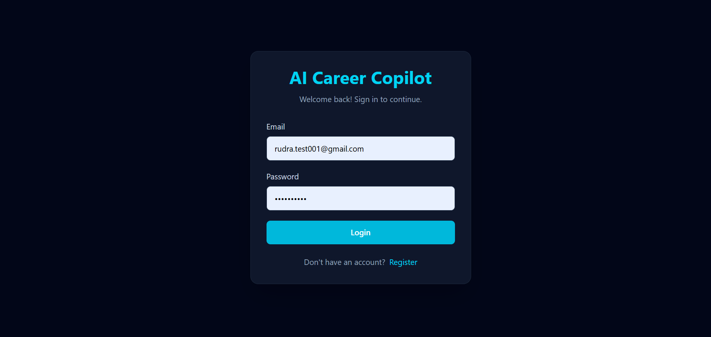
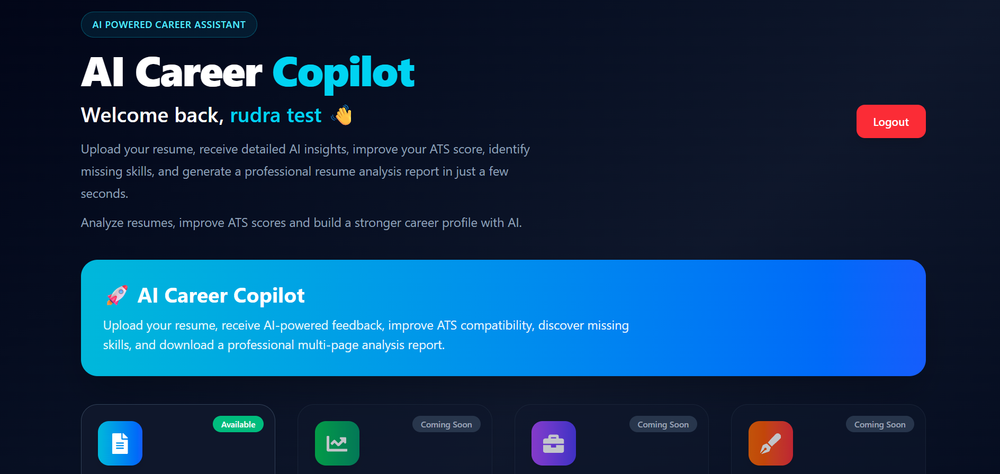
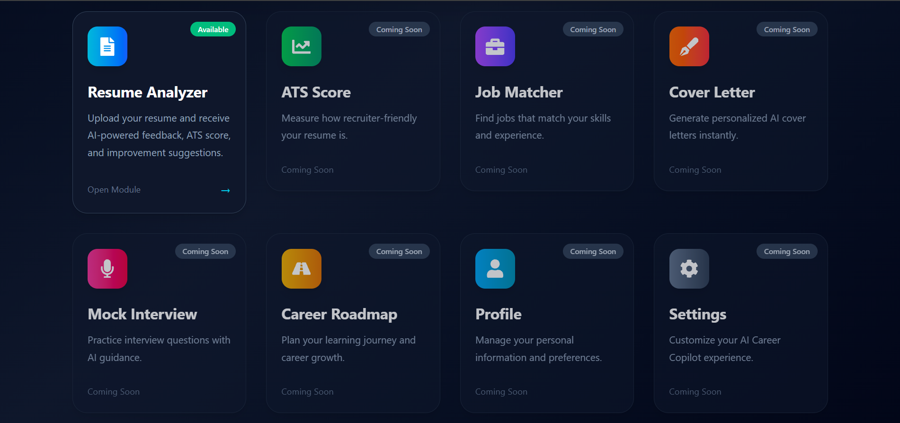
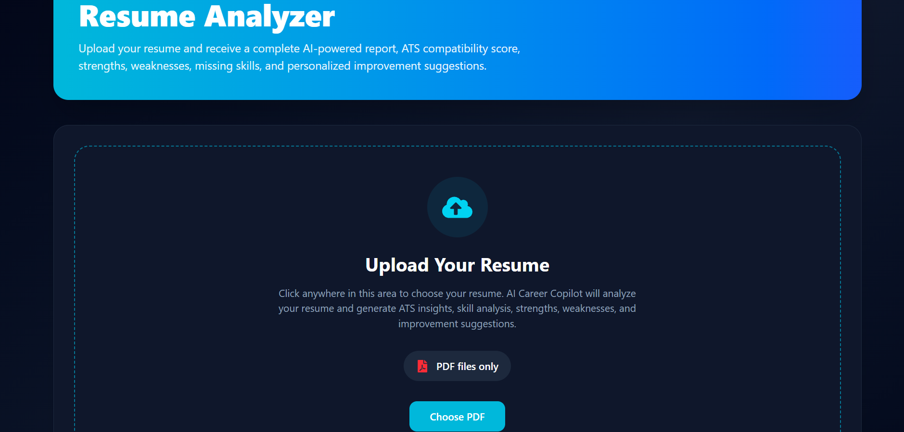
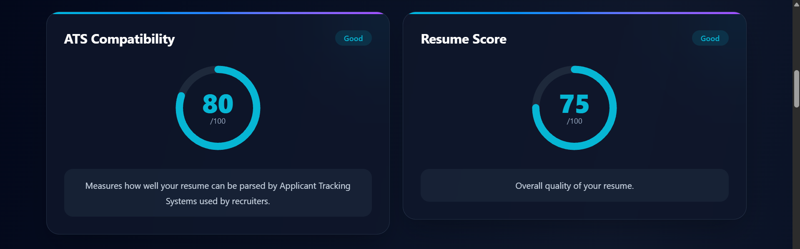
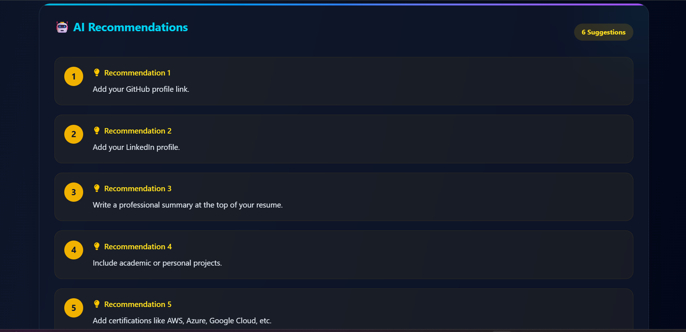
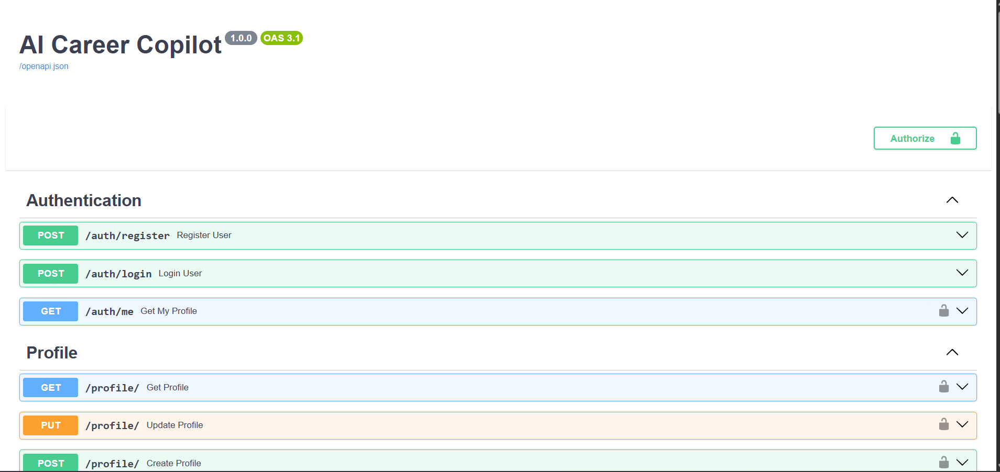

# 🚀 AI Career Copilot

<p align="center">
  
</p>

<p align="center">


</p>

---

## 📚 Table of Contents

- [Overview](#-overview)
- [Features](#-features)
- [Tech Stack](#-tech-stack)
- [Project Architecture](#-project-architecture)
- [Project Structure](#-project-structure)
- [Application Screenshots](#-application-screenshots)
- [Getting Started](#-getting-started)
- [API Endpoints](#-api-endpoints)
- [Version 2 Roadmap](#-version-2-roadmap)
- [Author](#-author)

## 📌 Overview

AI Career Copilot is an AI-powered career assistant designed to help students and job seekers improve their resumes using intelligent analysis.

The application analyzes uploaded resumes, evaluates ATS compatibility, identifies missing skills, provides AI-generated recommendations, and generates a professional PDF report.

Built using **FastAPI**, **React**, **TypeScript**, **PostgreSQL**, and **Google Gemini AI**, the project follows a production-style architecture with JWT authentication, protected routes, and modular backend services.

---

## 🌟 Project Highlights

- 🤖 AI-powered Resume Analysis
- 📊 ATS Compatibility Scoring
- 🔐 Secure JWT Authentication
- 📄 PDF Resume Parsing
- 🧠 Google Gemini AI Integration
- 📑 Professional PDF Report Generation
- 🚀 Railway Backend Deployment
- ⚡ Modern React + TypeScript Frontend

## 📌 Current Project Status

🟢 **Version:** 1.0.0

### Current Status

- ✅ Backend completed and deployed on Railway
- ✅ JWT Authentication implemented
- ✅ Resume PDF Upload
- ✅ AI Resume Analysis using Google Gemini
- ✅ ATS Compatibility Score
- ✅ Resume Score & Health Analysis
- ✅ Skills & Missing Skills Detection
- ✅ AI Resume Feedback & Suggestions
- ✅ PDF Report Generation
- ✅ Modern React + TypeScript Frontend
- ✅ Protected Routes
- ✅ Responsive Dashboard

### 🚧 Currently Working On

- Premium GitHub Documentation
- Project Branding
- GitHub Portfolio Optimization

### 🚀 Planned for Version 2

- Modern SaaS Dashboard
- AI Resume Builder
- AI Chat Assistant
- Resume Comparison
- Job Recommendation Engine
- AI Portfolio Generator
- Voice-based Mock Interview
- Interactive Analytics Dashboard
- Frontend Deployment (Vercel)

---

# ✨ Features

## 🔐 Authentication

- User Registration
- Secure Login using JWT Authentication
- Protected Routes
- Current User Authentication (`/auth/me`)

---

## 📄 Resume Analyzer

- Upload Resume (PDF)
- Extract Resume Text
- AI Resume Analysis
- Resume Score
- ATS Compatibility Score
- Resume Health Analysis
- Section-wise Performance
- Skills Detection
- Missing Skills Detection
- Email Detection
- Phone Number Detection

---

## 🤖 AI Features

- AI Resume Feedback
- Resume Improvement Suggestions
- Strength Analysis
- Weakness Analysis
- Resume Rewrite Suggestions
- AI Resume Health Report
- AI Career Roadmap
- AI Cover Letter Generator
- AI Interview Question Generator

---

## 📑 PDF Report

- Generate Professional Resume Analysis Report
- Download AI Analysis as PDF

---

## ⚙ Backend Features

- FastAPI REST APIs
- SQLAlchemy ORM
- PostgreSQL Database
- JWT Authentication
- Modular Service Architecture
- Railway Deployment

---

## 💻 Frontend Features

- React + TypeScript
- Tailwind CSS
- Responsive UI
- Protected Pages
- Beautiful Dashboard
- Toast Notifications
- Axios API Integration

---

# 🛠 Tech Stack

| Category | Technologies |
|----------|--------------|
| **Frontend** | React, TypeScript, Vite, Tailwind CSS |
| **Backend** | FastAPI, Python |
| **Database** | PostgreSQL |
| **ORM** | SQLAlchemy |
| **Authentication** | JWT (JSON Web Token) |
| **AI** | Google Gemini AI |
| **PDF Processing** | PyMuPDF |
| **API Communication** | Axios |
| **Deployment** | Railway |
| **Version Control** | Git & GitHub |

---

# 🏗 Project Architecture

```text
                        +----------------------+
                        |      React UI        |
                        |  (TypeScript + Vite) |
                        +----------+-----------+
                                   |
                                   |
                             Axios HTTP API
                                   |
                                   ▼
                        +----------------------+
                        |      FastAPI API     |
                        |   Authentication     |
                        | Resume Analyzer      |
                        | Career Roadmap       |
                        | Interview Generator  |
                        +----------+-----------+
                                   |
                +------------------+------------------+
                |                                     |
                ▼                                     ▼
      PostgreSQL Database                   Google Gemini AI
     (Users & Resume Data)             (AI Analysis & Feedback)
```

---

# 📂 Project Structure

```text
AI-CAREER-COPILOT
│
├── backend
│   ├── app
│   ├── uploads
│   ├── requirements.txt
│   └── main.py
│
├── frontend
│   ├── src
│   ├── public
│   ├── package.json
│   └── vite.config.ts
│
├── screenshots
├── assets
│   └── banner
├── docs
├── LICENSE
└── README.md
```

---

# 📸 Application Screenshots

## 🔐 Login Page

Secure JWT Authentication

<p align="center">

</p>

---

## 📝 Register Page

Create your AI Career Copilot account.

<p align="center">

</p>

---

## 🏠 Dashboard

Modern dashboard providing quick access to all AI modules.

<p align="center">

</p>

<p align="center">

</p>

---

## 📄 Resume Upload

Upload your resume in PDF format for AI analysis.

<p align="center">

</p>

<p align="center">

</p>

---

## 🤖 Resume Analysis

The AI analyzes the uploaded resume and generates ATS score, Resume Score, skills analysis and recommendations.

<p align="center">

</p>

<p align="center">

</p>

<p align="center">

</p>

<p align="center">

</p>

<p align="center">

</p>

---

## 📚 API Documentation

FastAPI automatically generated Swagger documentation.

<p align="center">

</p>

---

## ☁ Railway Deployment

Backend successfully deployed on Railway.

<p align="center">

</p>

---

# 🚀 Getting Started

## Clone Repository

```bash
git clone https://github.com/wakoderudra9-ship-it/AI-Career-Copilot.git
```

## Backend

```bash
cd backend

python -m venv venv

venv\Scripts\activate

pip install -r requirements.txt

uvicorn app.main:app --reload
```

Backend runs on

```
http://127.0.0.1:8000
```

---

## Frontend

```bash
cd frontend

npm install

npm run dev
```

Frontend runs on

```
http://localhost:5173
```

---

# 🔌 API Endpoints

## Authentication

- POST `/auth/register`
- POST `/auth/login`
- GET `/auth/me`

---

## Resume

- POST `/resume`

---

## Profile

- GET `/profile`
- PUT `/profile`

---

## AI Modules

- Career Roadmap
- Cover Letter Generator
- Interview Generator
- Mock Interview

---

# 🚀 Version 2 Roadmap

- Modern SaaS Dashboard
- AI Chat Assistant
- Resume Comparison
- Job Recommendation Engine
- Resume Builder
- Interactive Analytics Dashboard
- AI Portfolio Generator
- AI Mock Interview with Voice
- Email Notifications
- Frontend Deployment (Vercel)

---

# 👨‍💻 Author

**Rudra Wakode**

Final Year Information Technology Student

Passionate about Full Stack Development, Artificial Intelligence and Backend Engineering.

If you liked this project, consider giving it a ⭐ on GitHub.

---